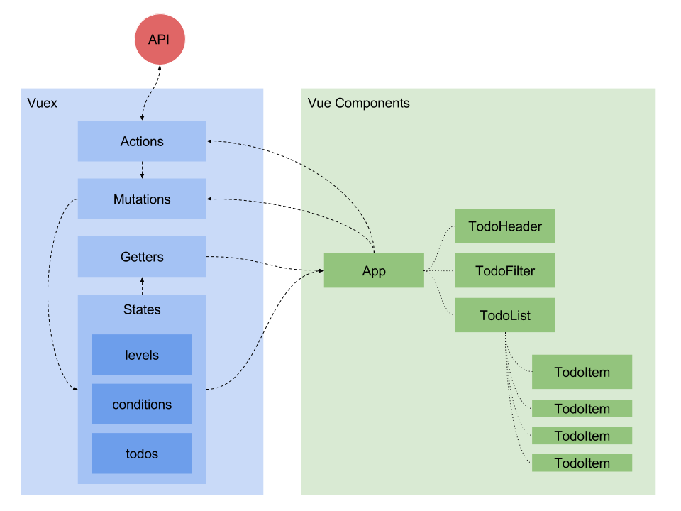

# TMON_TEST

## 0 개발환경
```sh
$ node -v
v6.11.1

$ npm -v
5.3.0

$ yarn -v
1.1.0
```

## 1 설치, 실행 & 빌드
```sh
$ yarn install
# or $ npm install

$ yarn dev
# or $ npm run dev

$ yarn build
# or $ npm run build
```

## 2 폴더 & 파일 설명
- dist : 번들링 후 파일들의 위치로 배포 전 폴더
  - answer.html
  - vendor.css
  - app.css
  - manifest.bundle.js
  - vendor.bundle.js
  - app.bundle.js
- src : 소스 코드 폴더
  - assets : .html, .css, .js 등 기타 파일들
  - components : 뷰 컴포넌트 폴더
  - App.vue : 기본 어플리케이션 파일
  - main.js : 어플리케이션을 html에 열결하는 파일로 번들링 후 app.bundle.js 파일로 번들링 됨
  - vendor.js : 주요 프레임워크를 선언해서 어플리케이션과 분리를 위한 파일.

## 3 프레임워크, 라이브러리 설명

개발 도구
- webpack : 웹팩, 번들러
- webpack-dev-server : 개발용 웹팩 서버
- cross-env : 노드 실행 환경 변수 지정
- clean-webpack-plugin : 웹팩 환경에서 파일을 삭제하는 플러그인
- copy-webpack-plugin : 웹팩 환경에서 파일을 복사하는 플러그인
- html-webpack-plugin : 웹팩 환경에서 HTML 파일을 생성하는 플러그인
- extract-text-webpack-plugin : 웹팩 환경에서 번들링 과정의 텍스트를 추출하는 플러그인
- babel-core : 바벨, ES6 트랜스파일러
- babel-preset-env : 바벨 프리셋
- babel-loader : 웹팩 환경에서 ES6를 변환하는 로더
- vue-loader : 웹팩 환경에서 뷰 컴포넌트를 변환하는 로더
- vue-template-compiler : 뷰 컴포넌트에서 템플릿을 컴파일
- style-loader : 웹팩 환경에서 CSS 파일을 변환하는 로더
- css-loader : 웹팩 환경에서 CSS 파일을 변환하는 로더

설정 파일
- .gitignore : 깃 관련 설정
- .babelrc : 바벨 관련 설정
- webpack.config.js : 웹팩 관련 설정

프레임워크 & 라이브러리
- vue : HTML, CSS, JavaScript 컴포넌트 프레임워크
- vuex : 뷰(프레임워크)의 상태를 관리하는 라이브러리
- bootstrap : CSS 프레임워크

## 4 애플리케이션 구조도


Vuex
- Actions : 비동적(API 호출 등)으로 상태를 변경해야할 경우 사용. 현재 사용하지 않음.
- Mutations : 상태를 변경하는 경우 호출, ex) 할일 추가(ADD_TODO), 할일 상태 변경(TOGGLE_TODO) 등
- Getters : 계산된 상태가 필요할 때 사용, ex) 필터링된 할일 목록(filterTodos) 등
- States : 어플리케이션의 상태를 관리.
  - levels : '매우 중요', '중요', '보통' 중요도 목록.
  - conditions : '완료', '미완료' 완료상태 목록.
  - todos : 할일 목록.

Vue Components
- App : 할일 어플리케이션의 기본 구조로 Vuex(Mutations, Getters, States)와 자식 컴포넌트를 연결.
  - TodoHeader : 상단영역으로 할일을 추가하는 기능.
  - TodoFilter : 할일 목록을 필터링 하는 기능.
  - TodoList : 할일을 리스트 형태로 표시. 자식 컴포넌트를 목록화.
    - TodoItem : 자식 컴포넌트로 할일을 내용을 표시하고 완료상태를 변경할 수 있음.

## 5 데이터
```js
[
  {
    "id": 1509989708819,
    "date": "2017. 11. 07.",
    "level": "veryimportant",
    "condition": "incomplete",
    "text": "세탁소에서 세탁물 찾아오기",
  }
]
```
- `id` : 할일 키값, 현재는 Date().valueOf()으로 대체하였습니다. 서버와 협의 보완이 필요합니다.
- `date` : string, 할일의 데이터의 생성된 날짜입니다. 포맷에 대한 보완이 필요합니다.
- `level` : string, 중요도를 나타내는 `veryimportant`, `important`, `normal` 중 하나의 값을 가집니다.
- `condition` : string, 할일의 완료상태를 나타내는 `complete`, `incomplete` 중 하나의 값을 가집니다.
- `text` : string, 할일의 내용을 나타냅니다.

## 6 정리
프레임워크 사용 이유
- webpack : HTML, CSS, JavaScript, images 리소스를 관리하는 개발 과정에서 편리함 때문에 사용했습니다.
- vue : 컴포넌트를 분리해서 개발하는 방식으로 화면을 구성하거나 변경하는데 편리함 때문에 사용했습니다.
- vuex : 뷰 컴포넌트의 화면에서 상태를 분리하므로써 상태를 변경하고 추적하는데 편리함 때문에 사용했습니다.
- bootstrap : 반응형 CSS 구조를 제어하는데 편리함 때문에 사용하였습니다.

보완해야 할 사항
- 코드 가독성을 위한 설정(Lint)이 없음.
- 코드 테스트 수행 안됨.
- 웹 접근성 테스트 수행이 안됨.
- 할 일의 수정 기능은 구현하지 못함.
- 드래그 앤 드랍 기능은 구현하지 못함.
